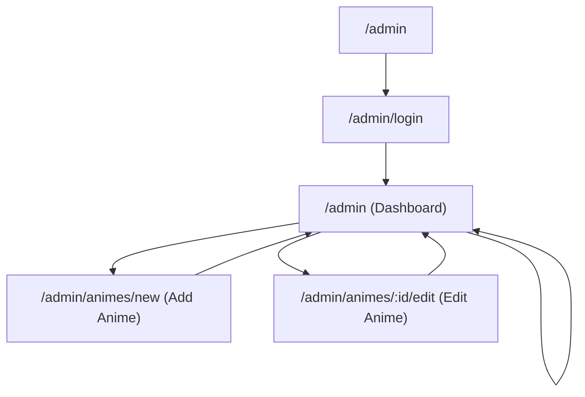

## 1. Product Overview
A lightweight Admin CMS to manage an anime catalog.
Admins access a protected /admin dashboard to add, edit, and delete anime entries.

## 2. Core Features

### 2.1 User Roles
| Role | Registration Method | Core Permissions |
|------|---------------------|------------------|
| Admin | Pre-created account (invited/seeded) | Can access /admin, create/update/delete anime, view dropdown metadata |
| Non-admin | N/A | Cannot access /admin or admin APIs |

### 2.2 Feature Module
Our Admin CMS consists of the following main pages:
1. **Admin Login**: authenticate admin user; redirect into /admin.
2. **Admin Dashboard (Anime List)**: sidebar navigation; list anime; edit/delete actions.
3. **Add / Edit Anime**: form with RU + EN (Romaji) fields; dropdowns populated from backend; submit changes.

### 2.3 Page Details
| Page Name | Module Name | Feature description |
|-----------|-------------|---------------------|
| Admin Login (/admin/login) | Login form | Authenticate admin; show validation errors; on success, start session and redirect to dashboard |
| Admin Dashboard (/admin) | Route protection | Block non-admin access; redirect to login |
| Admin Dashboard (/admin) | Sidebar | Navigate between Anime List and Add Anime; show current admin and logout |
| Admin Dashboard (/admin) | Anime list table | Display anime rows; support basic search/filter (optional); show edit/delete actions |
| Admin Dashboard (/admin) | Delete anime | Confirm intent; call delete endpoint; update list on success; show failure message |
| Add Anime (/admin/animes/new) | Anime form | Capture required fields including titles (RU and EN Romaji); load dropdown options from backend; client-side validation |
| Edit Anime (/admin/animes/:id/edit) | Prefill + update | Fetch existing anime; allow editing same fields as create; submit update; handle conflicts/errors |

## 3. Core Process
Admin Flow:
1. Open /admin → if not authenticated, redirect to /admin/login.
2. Log in as admin → redirected to /admin.
3. View anime list → choose Edit to update an entry, or Delete to remove it.
4. Choose Add Anime in sidebar → fill RU + EN (Romaji) fields and choose dropdown values fetched from backend → submit.

