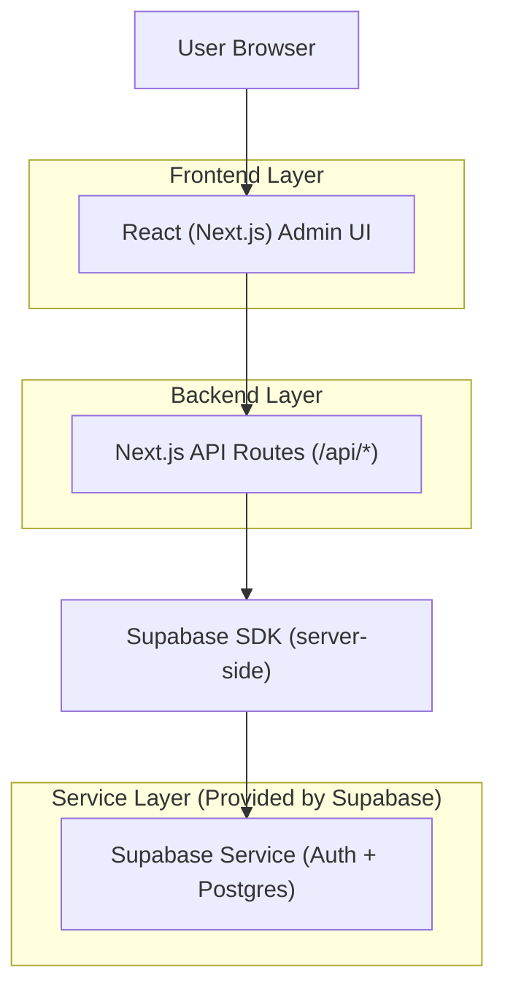
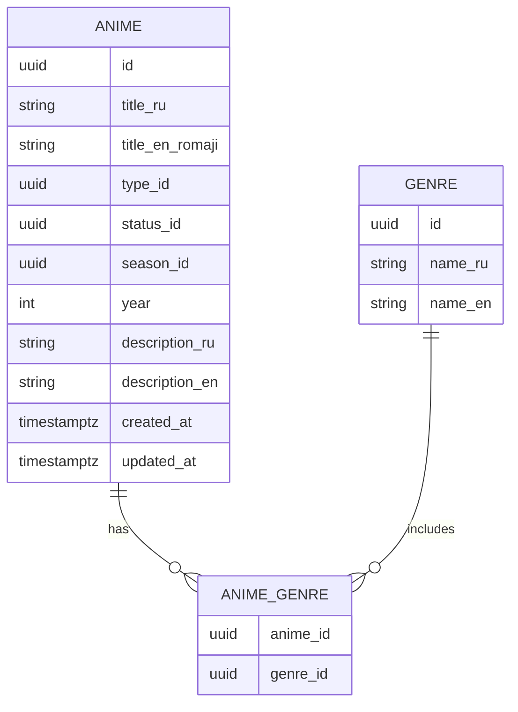

## 1.Architecture design


## 2.Technology Description
- Frontend: React@18 + Next.js (App Router) + TypeScript
- Backend: Next.js API Routes (Node runtime)
- Database/Auth: Supabase (PostgreSQL + Auth)

## 3.Route definitions
| Route | Purpose |
|-------|---------|
| /admin/login | Admin authentication page |
| /admin | Protected dashboard with sidebar + anime list |
| /admin/animes/new | Add-anime form |
| /admin/animes/[id]/edit | Edit-anime form |

## 4.API definitions (If it includes backend services)
### 4.1 Admin Anime API
Admin-only create
```
POST /api/admin/animes
```
Request (TypeScript)
```ts
type AnimeCreateInput = {
  titleRu: string;
  titleEnRomaji: string;
  typeId: string;       // dropdown
  statusId: string;     // dropdown
  seasonId?: string;    // dropdown (optional)
  year?: number;
  genreIds: string[];   // dropdown multi-select
  descriptionRu?: string;
  descriptionEn?: string;
};
```
Response
```ts
type AnimeDTO = {
  id: string;
  titleRu: string;
  titleEnRomaji: string;
  typeId: string;
  statusId: string;
  seasonId?: string;
  year?: number;
  genreIds: string[];
  createdAt: string;
  updatedAt: string;
};
```
Security notes
- Enforce admin-only via server-side session verification (Supabase Auth) + role/claim check.
- Reject non-admin with 401/403.

Supporting endpoints (for dropdowns)
```
GET /api/admin/meta
GET /api/admin/animes
GET /api/admin/animes/:id
PUT /api/admin/animes/:id
DELETE /api/admin/animes/:id
```

## 6.Data model(if applicable)
### 6.1 Data model definition


### 6.2 Data Definition Language
Anime table (anime)
```
CREATE TABLE anime (
  id UUID PRIMARY KEY DEFAULT gen_random_uuid(),
  title_ru TEXT NOT NULL,
  title_en_romaji TEXT NOT NULL,
  type_id UUID NOT NULL,
  status_id UUID NOT NULL,
  season_id UUID,
  year INT,
  description_ru TEXT,
  description_en TEXT,
  created_at TIMESTAMPTZ DEFAULT NOW(),
  updated_at TIMESTAMPTZ DEFAULT NOW()
);

CREATE TABLE genre (
  id UUID PRIMARY KEY DEFAULT gen_random_uuid(),
  name_ru TEXT NOT NULL,
  name_en TEXT NOT NULL
);

CREATE TABLE anime_genre (
  anime_id UUID NOT NULL,
  genre_id UUID NOT NULL
);

-- Permissions (typical Supabase baseline)
GRANT SELECT ON anime TO anon;
GRANT ALL PRIVILEGES ON anime TO authenticated;
```
