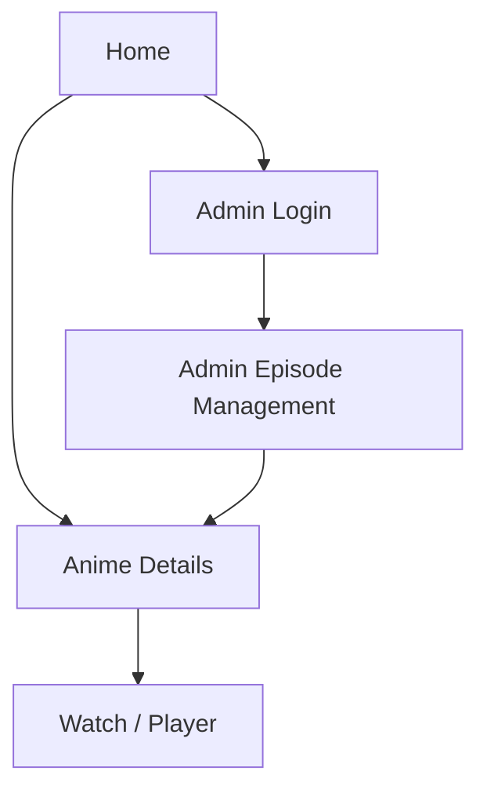

## 1. Product Overview
Rework episode logic around language-limited metadata and "voice groups".
Reset the database, seed an initial admin, and update admin + player UI to match the new schema.

## 2. Core Features

### 2.1 User Roles
| Role | Registration Method | Core Permissions |
|------|---------------------|------------------|
| Viewer | No registration | Browse anime and watch episodes; switch RU/EN (Romaji) labels |
| Admin | Pre-seeded account (Supabase email/password) | Manage voice groups and episodes; publish/unpublish |

### 2.2 Feature Module
Our requirements consist of the following main pages:
1. **Home**: anime list entry points, RU/EN (Romaji) label toggle.
2. **Anime Details**: anime summary, voice group list, episode entry point.
3. **Watch / Player**: video player, voice group selector, episode list (grouped), server label.
4. **Admin Login**: sign in/out.
5. **Admin Episode Management**: manage voice groups, manage episodes with `server_number` + `group_id`.

### 2.3 Page Details
| Page Name | Module Name | Feature description |
|-----------|-------------|---------------------|
| Home | Language toggle | Switch all user-facing labels between RU and EN (Romaji) only. |
| Home | Anime list | Navigate to an anime details page. |
| Anime Details | Voice groups summary | Show available voice groups for the anime (RU/EN names). |
| Anime Details | Watch entry | Open player on the selected anime (and optionally a default voice group). |
| Watch / Player | Playback | Play the selected episode; show loading/error states. |
| Watch / Player | Voice group selector | Switch between voice groups; refresh episode list accordingly. |
| Watch / Player | Episode list | Browse episodes within selected voice group; highlight current episode. |
| Watch / Player | Server indicator | Display `server_number` for the active episode (and use it in source selection logic). |
| Admin Login | Authentication | Sign in via Supabase Auth; block admin pages when signed out. |
| Admin Episode Management | Voice group CRUD | Create/edit/delete voice groups with RU + EN (Romaji) names; set display order. |
| Admin Episode Management | Episode CRUD | Create/edit/delete episodes with: anime, episode number, `group_id`, `server_number`, playback URL, publish toggle. |
| Admin Episode Management | Validation | Prevent duplicates for the same (anime, group, episode number) in admin UX. |

## 3. Core Process
**Viewer Flow**
1. Open Home and choose RU/EN (Romaji) labels.
2. Open an Anime Details page and pick a voice group (if multiple).
3. Open Watch / Player, select an episode, watch, and switch voice groups as needed.

**Admin Flow**
1. Sign in on Admin Login (admin is pre-seeded after DB reset).
2. In Admin Episode Management: create voice groups per anime.
3. Create episodes under a voice group, set `server_number`, set playback URL, publish.

