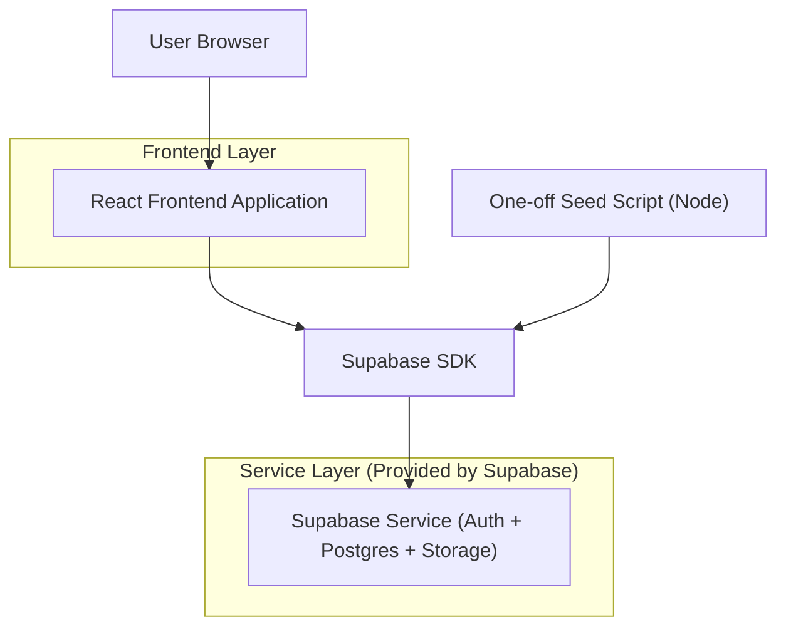
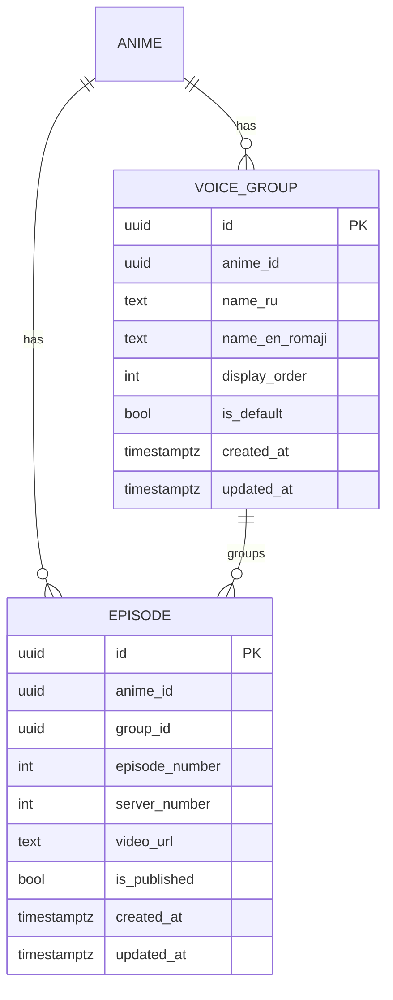

## 1.Architecture design


## 2.Technology Description
- Frontend: React@18 + TypeScript + vite + tailwindcss@3
- Backend: None (use Supabase directly from frontend)
- Data/Auth: Supabase (PostgreSQL + Auth)
- Tooling: Node script for DB reset verification + admin seeding (uses Supabase service-role key; never shipped to client)

## 3.Route definitions
| Route | Purpose |
|-------|---------|
| / | Home (anime list + RU/EN toggle) |
| /anime/:animeId | Anime details + voice group summary |
| /watch/:animeId?group=:groupId&ep=:episodeNumber | Player page (voice group + episode selection) |
| /admin/login | Admin auth |
| /admin/anime/:animeId/episodes | Admin voice groups + episodes management |

## 6.Data model(if applicable)

### 6.1 Data model definition


### 6.2 Data Definition Language
Voice Groups (voice_groups)
```sql
CREATE TABLE voice_groups (
  id uuid PRIMARY KEY DEFAULT gen_random_uuid(),
  anime_id uuid NOT NULL,
  name_ru text NOT NULL,
  name_en_romaji text NOT NULL,
  display_order int NOT NULL DEFAULT 0,
  is_default boolean NOT NULL DEFAULT false,
  created_at timestamptz NOT NULL DEFAULT now(),
  updated_at timestamptz NOT NULL DEFAULT now()
);
CREATE INDEX idx_voice_groups_anime_id ON voice_groups(anime_id);

CREATE TABLE episodes (
  id uuid PRIMARY KEY DEFAULT gen_random_uuid(),
  anime_id uuid NOT NULL,
  group_id uuid NOT NULL,
  episode_number int NOT NULL,
  server_number int NOT NULL DEFAULT 1,
  video_url text NOT NULL,
  is_published boolean NOT NULL DEFAULT false,
  created_at timestamptz NOT NULL DEFAULT now(),
  updated_at timestamptz NOT NULL DEFAULT now()
);
CREATE INDEX idx_episodes_anime_group_ep ON episodes(anime_id, group_id, episode_number);
CREATE INDEX idx_episodes_published ON episodes(is_published);

GRANT SELECT ON voice_groups TO anon;
GRANT SELECT ON episodes TO anon;
GRANT ALL PRIVILEGES ON voice_groups TO authenticated;
GRANT ALL PRIVILEGES ON episodes TO authenticated;
```

## Migration / rework plan (implementation notes)
1. **DB reset**: drop old episode-related tables, then run the new DDL; confirm frontend queries compile against the new schema.
2. **Seed admin**: run a one-off Node script using Supabase Admin API (service-role key) to create the initial admin user, then store their email/password out-of-band.
3. **Locale reduction**: remove all non-RU and non-EN(Romaji) fields from UI forms and user display; ensure only `name_ru` + `name_en_romaji` are required.
4. **Admin UX update**: add voice group management and require selecting `group_id` + `server_number` on episode creation.
5. **Player UX update**: query voice groups for an anime, default to `is_default` (or first by `display_order`), then list episodes filtered by selected `group_id` (and `is_published=true` for viewers).
