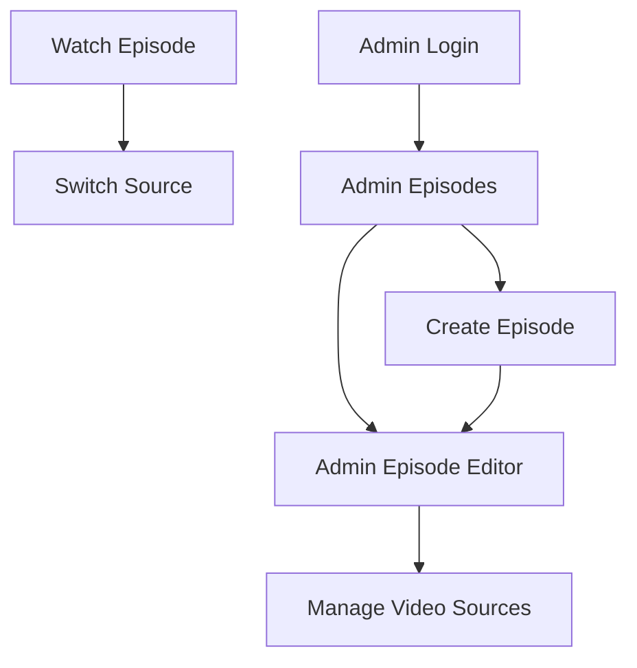

## 1. Product Overview
Enable each episode to have multiple video sources (“servers”) with metadata (label, playback type, URL). Admins can CRUD sources, and viewers can switch sources on the watch page. Creating an episode automatically creates a default source entry.

## 2. Core Features

### 2.1 User Roles
| Role | Registration Method | Core Permissions |
|------|---------------------|------------------|
| Viewer | No registration required | Can watch an episode and switch sources |
| Admin | Email login (Supabase Auth) | Can create/edit episodes and manage episode sources |

### 2.2 Feature Module
Our requirements consist of the following main pages:
1. **Watch Episode**: video player, server/source switcher, source error fallback.
2. **Admin Login**: sign in/out.
3. **Admin Episodes**: episode list, create episode, edit episode.
4. **Admin Episode Editor**: episode fields + embedded “Video Sources” CRUD.

### 2.3 Page Details
| Page Name | Module Name | Feature description |
|-----------|-------------|---------------------|
| Watch Episode | Episode context | Load episode and its active sources; show title/number context. |
| Watch Episode | Player rendering | Render selected source by type: iframe embed (iframe src) or direct video (HTML5 video src). |
| Watch Episode | Source switcher | List sources by label; allow switching; persist last selected source per episode in local storage. |
| Watch Episode | Failure handling | Detect load/play errors; show message and quick switch to another source. |
| Admin Login | Authentication | Sign in via Supabase; restrict admin routes to authenticated users. |
| Admin Episodes | Episode list | Display episodes with search/sort (basic); open editor; create new episode. |
| Admin Episodes | Create episode | Create episode record; automatically create one default source record for that episode. |
| Admin Episode Editor | Episode fields | Edit core episode metadata (e.g., title/number/slug as already used in your app). |
| Admin Episode Editor | Video sources list | Show sources table: label, type (iframe/direct), url, default toggle, active toggle, order. |
| Admin Episode Editor | Video sources CRUD | Add/edit/delete sources; validate URL format; prevent deleting the last remaining source. |
| Admin Episode Editor | Default source rules | Ensure exactly one default source per episode; if default is changed, update others to non-default. |

## 3. Core Process
**Viewer Flow**
1. Open an episode watch page.
2. Page loads episode sources, selects default (or last selected source).
3. Viewer switches sources if playback fails or prefers another server.

**Admin Flow**
1. Admin logs in.
2. Admin creates an episode.
3. System auto-creates a default source for the new episode (label and type prefilled; URL editable).
4. Admin edits the episode and manages video sources (add servers, set default, reorder, deactivate).

