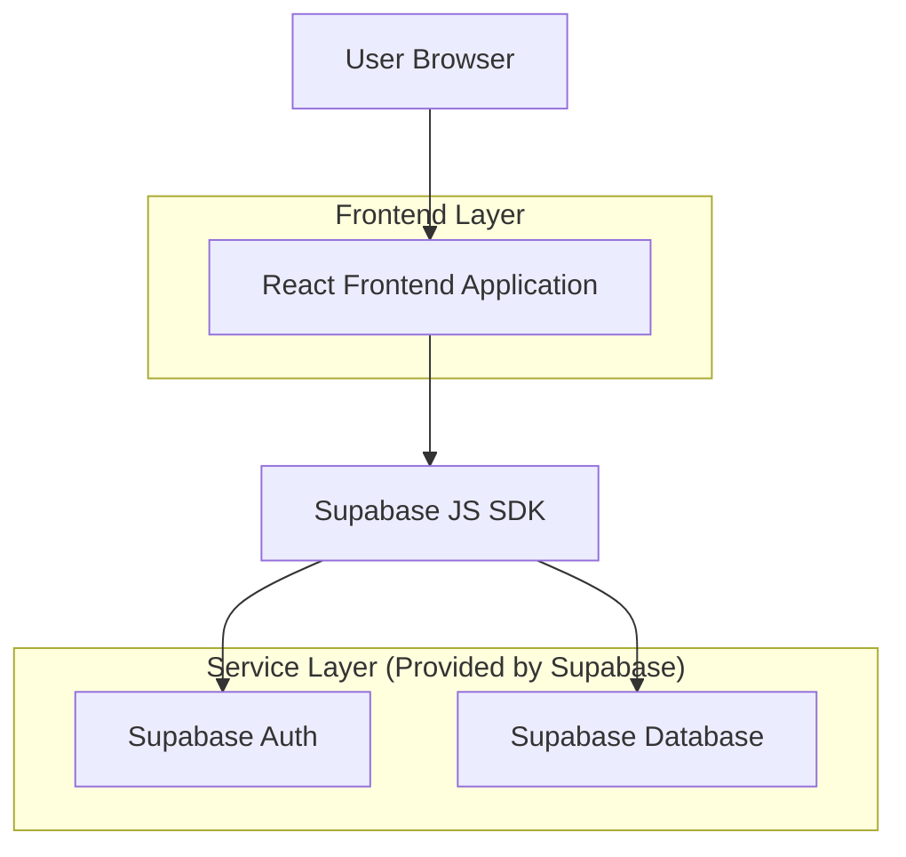
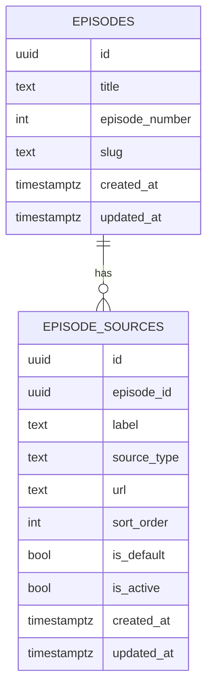

## 1.Architecture design


## 2.Technology Description
- Frontend: React@18 + TypeScript + vite + tailwindcss@3
- Backend: Supabase (Auth + Postgres)

## 3.Route definitions
| Route | Purpose |
|-------|---------|
| /watch/:episodeId | Watch page with player + source switching |
| /login | Admin login |
| /admin/episodes | Admin episode list + create entry point |
| /admin/episodes/new | Admin create episode form |
| /admin/episodes/:episodeId | Admin episode editor + video source CRUD |

## 6.Data model(if applicable)

### 6.1 Data model definition


### 6.2 Data Definition Language
Episode Sources Table (episode_sources)
```sql
-- enums (optional; could also be TEXT + CHECK)
-- source_type: 'iframe' | 'direct'

CREATE TABLE episode_sources (
  id UUID PRIMARY KEY DEFAULT gen_random_uuid(),
  episode_id UUID NOT NULL, -- logical FK to episodes.id (no physical FK constraint)
  label TEXT NOT NULL,
  source_type TEXT NOT NULL CHECK (source_type IN ('iframe','direct')),
  url TEXT NOT NULL DEFAULT '',
  sort_order INTEGER NOT NULL DEFAULT 0,
  is_default BOOLEAN NOT NULL DEFAULT FALSE,
  is_active BOOLEAN NOT NULL DEFAULT TRUE,
  created_at TIMESTAMPTZ NOT NULL DEFAULT NOW(),
  updated_at TIMESTAMPTZ NOT NULL DEFAULT NOW()
);

CREATE INDEX idx_episode_sources_episode_id ON episode_sources(episode_id);
CREATE INDEX idx_episode_sources_episode_sort ON episode_sources(episode_id, sort_order);

-- recommended: enforce one default per episode in application logic

-- basic grants (typical Supabase pattern)
GRANT SELECT ON episode_sources TO anon;
GRANT ALL PRIVILEGES ON episode_sources TO authenticated;
```

Notes
- Default source creation on episode create: implement as an application-side transaction-like sequence: create episode -> insert one episode_sources row with is_default=true.
- Authorization: viewers (anon) can read only active sources; admins (authenticated) can full CRUD (enforced via RLS policies).
- RLS (high level):
  - anon: SELECT where is_active=true
  - authenticated: full access
