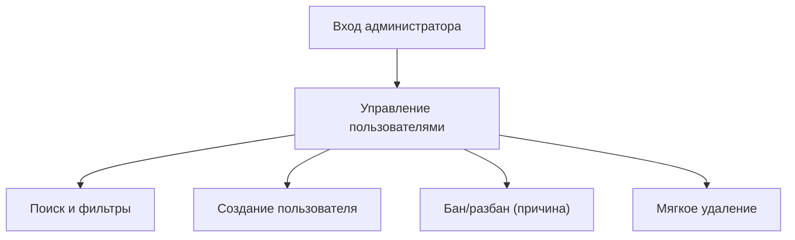

## 1. Product Overview
Веб-раздел для админов, позволяющий управлять пользователями: искать/фильтровать, создавать, удалять (мягко) и банить с указанием причины.
Цель — централизованный контроль доступа и модерации, доступный только администраторам.

## 2. Core Features

### 2.1 User Roles
| Role | Registration Method | Core Permissions |
|------|---------------------|------------------|
| Администратор | Создаётся вручную (seed/в БД) и выдаётся роль `admin` | Доступ в админ-раздел; просмотр/поиск/фильтры пользователей; создание; мягкое удаление; бан/разбан с причиной |
| Пользователь | Самостоятельная регистрация | Использует основной продукт; не имеет доступа к админ-разделу |

### 2.2 Feature Module
1. **Вход администратора**: форма входа, проверка роли admin, обработка ошибок.
2. **Управление пользователями**: список, поиск, фильтры, создание пользователя, мягкое удаление, бан/разбан с причиной.

### 2.3 Page Details
| Page Name | Module Name | Feature description |
|-----------|-------------|---------------------|
| Вход администратора | Авторизация | Выполнять вход по email/паролю; показывать ошибки (неверные данные/нет прав) |
| Вход администратора | Защита доступа | Перенаправлять не-админов на страницу входа/«нет доступа»; не раскрывать наличие аккаунтов |
| Управление пользователями | Список пользователей | Отображать таблицу пользователей; показывать статус (активен/забанен/удалён), дату регистрации; постраничную навигацию |
| Управление пользователями | Поиск | Искать по email/никнейму/ID (частичное совпадение) |
| Управление пользователями | Фильтры | Фильтровать по статусу (активен/забанен/удалён) и роли (user/admin) |
| Управление пользователями | Создание пользователя | Создавать пользователя по email (+ опционально имя/ник); показывать результат и дальнейшие шаги (например, «попросите пользователя установить пароль») |
| Управление пользователями | Бан/разбан | Банить пользователя с обязательной причиной; отображать активный бан и причину; снимать бан |
| Управление пользователями | Удаление | Выполнять мягкое удаление пользователя с подтверждением; скрывать/помечать удалённых в списке по фильтру |

## 3. Core Process
**Админский поток:**
1) Админ открывает админ-раздел и проходит вход.
2) Система проверяет роль `admin`; при успехе открывает управление пользователями.
3) Админ ищет/фильтрует пользователей, открывает действия строки.
4) Админ создаёт пользователя (ввод email и базовых данных).
5) Админ банит пользователя, указывая причину, либо снимает бан.
6) При необходимости админ выполняет мягкое удаление с подтверждением.

