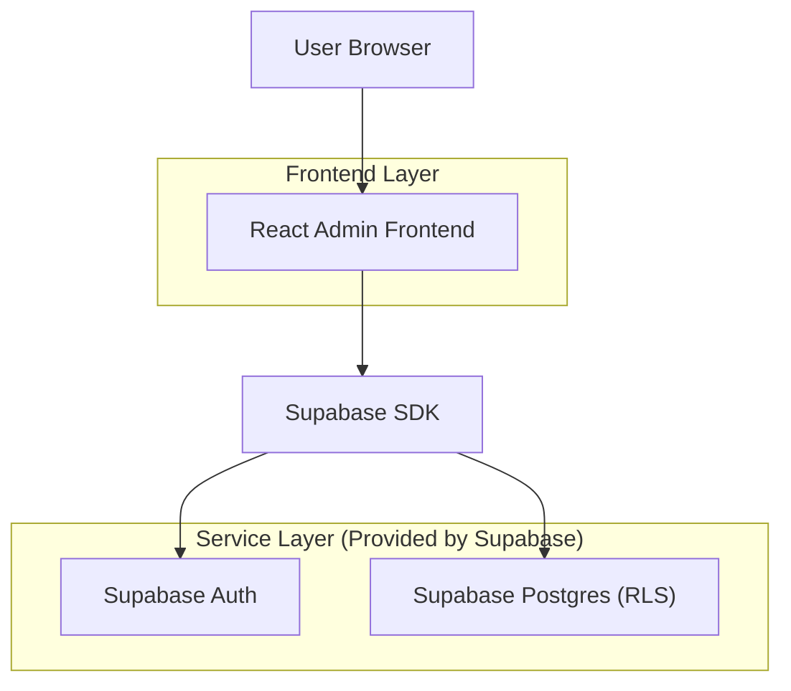
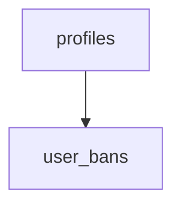

## 1.Architecture design


## 2.Technology Description
- Frontend: React@18 + vite + tailwindcss@3
- Backend: Supabase (Auth + PostgreSQL)

## 3.Route definitions
| Route | Purpose |
|-------|---------|
| /admin/login | Вход администратора и проверка прав |
| /admin/users | Управление пользователями: список/поиск/фильтры/создание/бан/удаление |

## 6.Data model(if applicable)

### 6.1 Data model definition
- `profiles`: прикладной профиль пользователя (роль, статус, отображаемые данные).
- `user_bans`: активные/исторические баны с причиной.



### 6.2 Data Definition Language
profiles
```
CREATE TABLE profiles (
  id UUID PRIMARY KEY,
  email VARCHAR(255) UNIQUE NOT NULL,
  display_name VARCHAR(100),
  role VARCHAR(20) NOT NULL DEFAULT 'user',
  status VARCHAR(20) NOT NULL DEFAULT 'active',
  created_at TIMESTAMPTZ NOT NULL DEFAULT NOW(),
  updated_at TIMESTAMPTZ NOT NULL DEFAULT NOW()
);

-- Без физических FK: используем логические ссылки на id
CREATE INDEX idx_profiles_email ON profiles (email);
CREATE INDEX idx_profiles_role ON profiles (role);
CREATE INDEX idx_profiles_status ON profiles (status);
```

user_bans
```
CREATE TABLE user_bans (
  id UUID PRIMARY KEY DEFAULT gen_random_uuid(),
  user_id UUID NOT NULL,
  reason TEXT NOT NULL,
  is_active BOOLEAN NOT NULL DEFAULT TRUE,
  banned_by UUID NOT NULL,
  banned_at TIMESTAMPTZ NOT NULL DEFAULT NOW(),
  unbanned_at TIMESTAMPTZ
);

CREATE INDEX idx_user_bans_user_id ON user_bans (user_id);
CREATE INDEX idx_user_bans_is_active ON user_bans (is_active);
```

Права (минимально необходимые)
```
-- Публичный доступ не нужен
-- GRANT SELECT ON profiles TO anon;
-- GRANT SELECT ON user_bans TO anon;

GRANT SELECT, INSERT, UPDATE ON profiles TO authenticated;
GRANT SELECT, INSERT, UPDATE ON user_bans TO authenticated;
```

RLS (логика)
- Включить RLS на `profiles` и `user_bans`.
- Правило «admin-only» для админ-операций: разрешать SELECT/INSERT/UPDATE только пользователям с `profiles.role = 'admin'`.
- (Опционально, если нужно для основного продукта) разрешить пользователю читать/обновлять только свой `profiles.id = auth.uid()`.

Примечание по “удалению пользователя”
- В MVP реализовать мягкое удаление через `profiles.status = 'deleted'`.
- Полное удаление из Supabase Auth требует сервисного ключа (не хранить в клиенте) — выносится в отдельный защищённый backend/edge-function при необходимости.