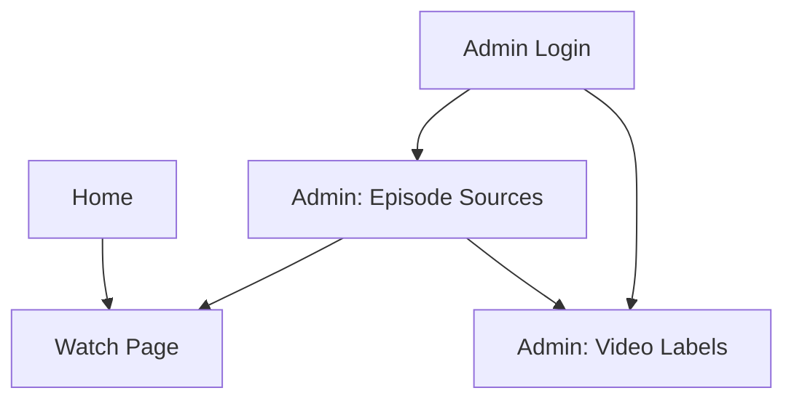

## 1. Product Overview
Create a global “Video Labels” dictionary used by all video sources.
Replace free-text `video_sources.label` with `label_id`, and adjust Watch Page UI when a label indicates an external player.

## 2. Core Features

### 2.1 User Roles
| Role | Registration Method | Core Permissions |
|------|---------------------|------------------|
| Viewer | No login (default) | Can open Watch Page, switch sources, watch episodes |
| Admin | Existing admin login | Can manage Video Labels and assign labels to video sources |

### 2.2 Feature Module
Our requirements consist of the following main pages:
1. **Watch Page**: video player, source selection, dub/sub controls, label display.
2. **Admin: Video Labels**: create/edit/archive labels, configure external-player behavior.
3. **Admin: Episode Sources**: assign a label to each video source using the global dictionary.

### 2.3 Page Details
| Page Name | Module Name | Feature description |
|-----------|-------------|---------------------|
| Watch Page | Source list | Select a source; display its associated label name consistently across the site. |
| Watch Page | Audio controls (Dub/Sub) | Show dub/sub toggle only when selected source’s label is not marked as external player. |
| Watch Page | External-player mode | When `label.is_external_player=true`, hide dub/sub UI and render player per existing external-player behavior (e.g., embed/open). |
| Admin: Video Labels | Labels table | List labels with name + key fields; open create/edit form. |
| Admin: Video Labels | Create/Edit label | Create/update label fields: display name; `is_external_player` flag; optional description. |
| Admin: Video Labels | Safe deactivation | Disable/Archive a label (so it can’t be newly assigned), while keeping existing sources readable. |
| Admin: Episode Sources | Label assignment | Replace free-text label input with a label dropdown; save `label_id` to the source record. |
| Admin: Episode Sources | Backward compatibility visibility | If a source references a missing/archived label, show a clear “Unknown/Archived label” state. |

## 3. Core Process
**Admin Flow**
1. Admin opens “Video Labels” and creates/edits labels (including whether it is an external player).
2. Admin opens an episode’s sources and assigns a label from the dictionary to each source.

**Viewer Flow**
1. Viewer opens Watch Page and selects an episode/source.
2. Watch Page loads the source’s label.
3. If the label is external-player, the page hides dub/sub controls; otherwise dub/sub is available.

