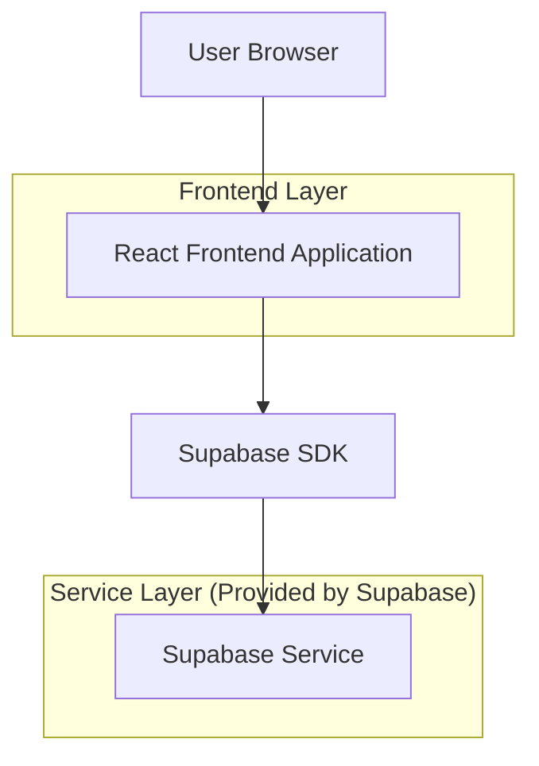
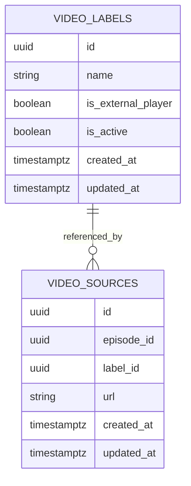

## 1.Architecture design


## 2.Technology Description
- Frontend: React@18 + TypeScript + vite
- Backend: Supabase (Auth + PostgreSQL)

## 3.Route definitions
| Route | Purpose |
|-------|---------|
| /watch/:animeId/:episodeId | Watch an episode; select source; apply label-based UI rules |
| /admin/video-labels | CRUD Video Labels dictionary |
| /admin/episodes/:episodeId/sources | Manage episode sources; assign `label_id` |

## 6.Data model(if applicable)

### 6.1 Data model definition


### 6.2 Data Definition Language
Video Labels (video_labels)
```sql
CREATE TABLE video_labels (
  id UUID PRIMARY KEY DEFAULT gen_random_uuid(),
  name TEXT NOT NULL,
  is_external_player BOOLEAN NOT NULL DEFAULT false,
  is_active BOOLEAN NOT NULL DEFAULT true,
  created_at TIMESTAMPTZ NOT NULL DEFAULT now(),
  updated_at TIMESTAMPTZ NOT NULL DEFAULT now()
);

CREATE UNIQUE INDEX video_labels_name_unique ON video_labels (lower(name));
```

Video Sources change (video_sources)
```sql
-- 1) Add new column
ALTER TABLE video_sources ADD COLUMN label_id UUID;

-- 2) Backfill (migration script concept)
-- For each distinct old video_sources.label text:
--   upsert into video_labels(name, is_external_player, is_active)
--   then update video_sources.label_id
-- (Implementation depends on existing data + admin expectations.)

-- 3) Enforce non-null when ready
-- ALTER TABLE video_sources ALTER COLUMN label_id SET NOT NULL;

-- 4) Remove old column after rollout
-- ALTER TABLE video_sources DROP COLUMN label;

CREATE INDEX video_sources_label_id_idx ON video_sources(label_id);
```

Permissions (baseline; refine with RLS as needed)
```sql
GRANT SELECT ON video_labels TO anon;
GRANT ALL PRIVILEGES ON video_labels TO authenticated;

GRANT SELECT ON video_sources TO anon;
GRANT ALL PRIVILEGES ON video_sources TO authenticated;
```