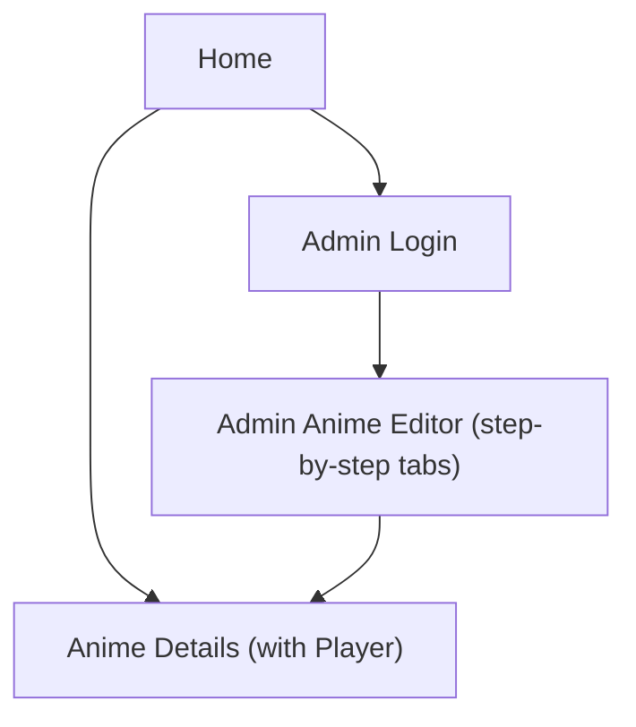

## 1. Product Overview
Implement a new episode model based on **voice groups** and expose a nested episodes payload on **GET /api/animes/:slug**.
Update the Admin UI into a step-by-step (tabbed) editor and ensure the Player/UI supports **RU + EN (Romaji) only**.

## 2. Core Features

### 2.1 User Roles
| Role | Registration Method | Core Permissions |
|------|---------------------|------------------|
| Viewer | No registration | Browse anime, view details, watch episodes, switch RU/EN (Romaji) labels |
| Admin | Existing login flow | Create/update anime metadata, manage voice groups and episodes |

### 2.2 Feature Module
Our requirements consist of the following main pages:
1. **Home**: anime discovery entry point; RU/EN (Romaji) UI toggle.
2. **Anime Details (with Player section)**: anime info; watch CTA; embedded player with voice-group + episode selection.
3. **Admin Login**: authenticate admin access.
4. **Admin Anime Editor (step-by-step tabs)**: edit anime; manage voice groups; manage episodes.

### 2.3 Page Details
| Page Name | Module Name | Feature description |
|-----------|-------------|---------------------|
| Home | Language toggle | Switch all user-facing labels between RU and EN (Romaji) only. |
| Home | Anime list | Open an anime details page by slug. |
| Anime Details (with Player) | Anime header | Display poster, titles (RU + Romaji), summary, metadata. |
| Anime Details (with Player) | Player | Play the selected episode; fallback to trailer when no episodes exist; show loading/error states. |
| Anime Details (with Player) | Voice group selector | Switch between voice groups (Dubbed/Subbed); show name in selected UI language. |
| Anime Details (with Player) | Episode selector | Show episodes for selected voice group; highlight current; allow quick switching. |
| Admin Login | Authentication | Sign in/out; block admin routes when signed out. |
| Admin Anime Editor (tabs) | Step tabs | Guide admin through required steps; prevent skipping required fields. |
| Admin Anime Editor (tabs) | Anime fields | Edit core anime fields and RU/EN (Romaji) translations; show computed slug. |
| Admin Anime Editor (tabs) | Voice groups | Create/edit/delete voice groups per anime; set order and default. |
| Admin Anime Editor (tabs) | Episodes | Create/edit/delete episodes under a voice group; require server number; prevent duplicates per (anime, voice_group, episode_number). |

## 3. Core Process
**Viewer Flow**
1. Open Home and choose RU/EN (Romaji) labels.
2. Open Anime Details by slug.
3. In Player: choose Server (if applicable), Dubbed/Subbed, Voice Group, then Episode.

**Admin Flow**
1. Sign in on Admin Login.
2. Open Admin Anime Editor.
3. Complete tabs in order: Anime basics → Translations → Voice groups → Episodes → Review & Save.

