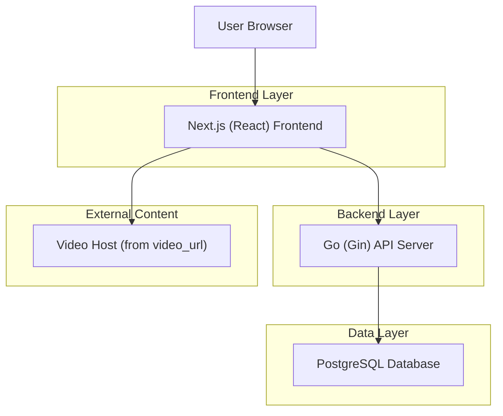
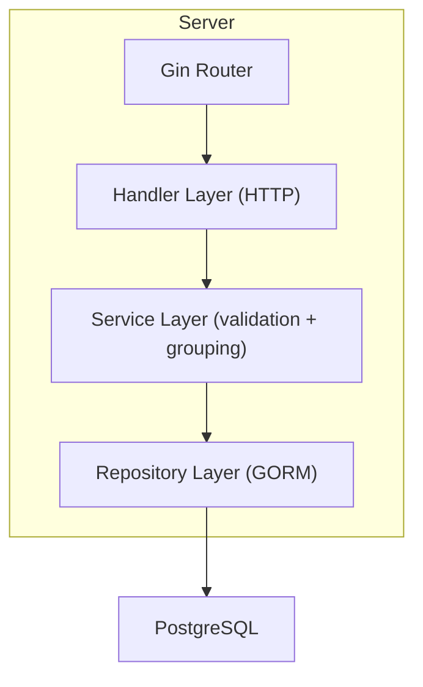
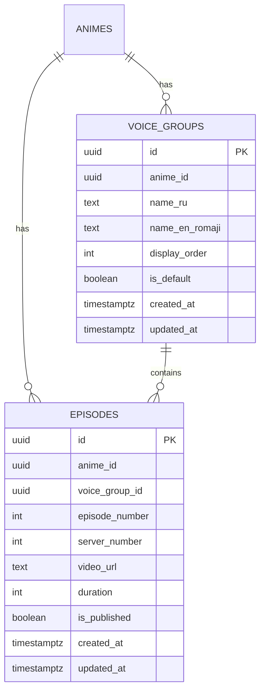

## 1.Architecture design


## 2.Technology Description
- Frontend: Next.js@14 (React@18) + TypeScript + tailwindcss + shadcn/ui
- Backend: Go + gin-gonic/gin + GORM
- Database: PostgreSQL
- Player: HTML5 video + iframe support (based on stored `video_url`)

## 3.Route definitions
| Route | Purpose |
|-------|---------|
| / | Home (anime list + RU/EN toggle) |
| /anime/:slug | Anime details with embedded Player and episode selection |
| /admin/login | Admin authentication |
| /admin/animes/:id | Admin anime editor (step-by-step tabs including voice groups + episodes) |

## 4.API definitions (If it includes backend services)

### 4.1 Core API
**Get anime by slug with nested episodes**
```
GET /api/animes/:slug
```
Response (conceptual TypeScript shapes):
```ts
type VoiceGroupDTO = {
  id: string
  anime_id: string
  name_ru: string
  name_en_romaji: string
  display_order: number
  is_default: boolean
}

type EpisodeDTO = {
  id: string
  anime_id: string
  voice_group_id: string
  episode_number: number
  server_number: number
  video_url: string
  duration?: number
  is_published: boolean
}

type VoiceGroupWithEpisodesDTO = VoiceGroupDTO & { episodes: EpisodeDTO[] }

type AnimeDetailsResponse = {
  anime: any
  voice_groups: {
    dubbed: VoiceGroupWithEpisodesDTO[]
    subbed: VoiceGroupWithEpisodesDTO[]
  }
}
```
Notes:
- Viewer-facing responses MUST filter to `is_published=true`.
- Group ordering: `display_order ASC`, then RU/EN fallback.
- Episode ordering: `episode_number ASC`.

### 4.2 Admin API (minimum)
- Manage voice groups
```
GET /api/admin/animes/:id/voice-groups
POST /api/admin/animes/:id/voice-groups
PUT /api/admin/voice-groups/:id
DELETE /api/admin/voice-groups/:id
```
- Manage episodes
```
GET /api/admin/animes/:id/episodes?voice_group_id=...&server_number=...
POST /api/admin/animes/:id/episodes
PUT /api/admin/episodes/:id
DELETE /api/admin/episodes/:id
```

## 5.Server architecture diagram (If it includes backend services)


## 6.Data model(if applicable)

### 6.1 Data model definition


### 6.2 Data Definition Language
```sql
CREATE TABLE voice_groups (
  id uuid PRIMARY KEY DEFAULT gen_random_uuid(),
  anime_id uuid NOT NULL,
  name_ru text NOT NULL,
  name_en_romaji text NOT NULL,
  display_order int NOT NULL DEFAULT 0,
  is_default boolean NOT NULL DEFAULT false,
  created_at timestamptz NOT NULL DEFAULT now(),
  updated_at timestamptz NOT NULL DEFAULT now()
);
CREATE INDEX idx_voice_groups_anime_id ON voice_groups(anime_id);

CREATE TABLE episodes (
  id uuid PRIMARY KEY DEFAULT gen_random_uuid(),
  anime_id uuid NOT NULL,
  voice_group_id uuid NOT NULL,
  episode_number int NOT NULL,
  server_number int NOT NULL DEFAULT 1,
  video_url text NOT NULL,
  duration int,
  is_published boolean NOT NULL DEFAULT false,
  created_at timestamptz NOT NULL DEFAULT now(),
  updated_at timestamptz NOT NULL DEFAULT now()
);
CREATE INDEX idx_episodes_anime_vg_ep ON episodes(anime_id, voice_group_id, episode_number);
CREATE INDEX idx_episodes_published ON episodes(is_published);
```
